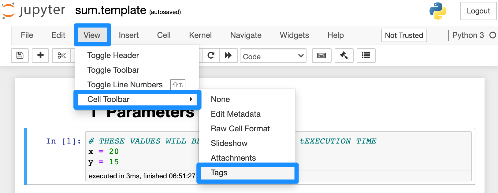
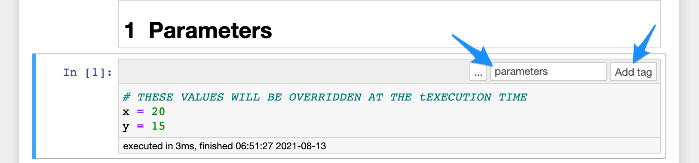
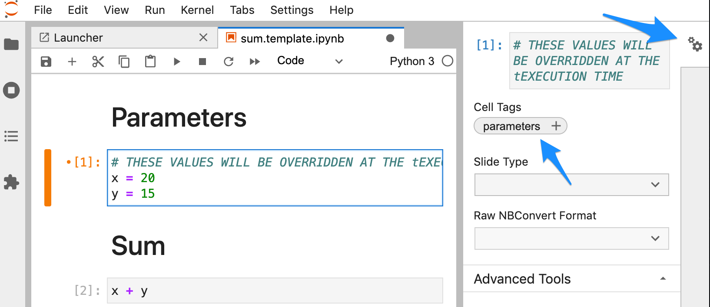
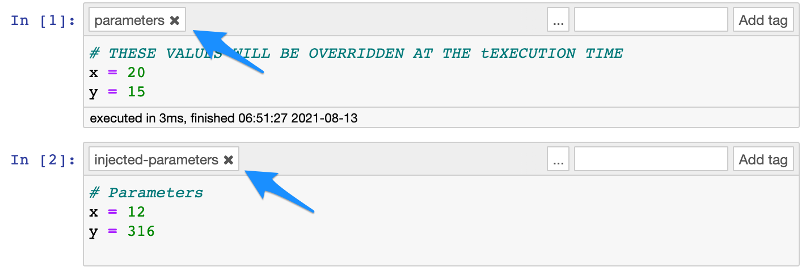

## Intro

How do I run a notebook from the terminal?

### Preparation

Original: [sum.ipynb](intro/sum.ipynb)

Change `x` and `y`, run the notebook from the terminal.

```bash
papermill sum.template.ipynb test.ipynb
```

Convert to template: [sum.template.ipynb](intro/sum.template.ipynb)

- Make a copy.
- Rename as `sum.template`.
- Add headings.
- Add a comment: `THESE VALUES SHOULD BE OVERRIDDEN AT THE EXECUTION TIME`
- Add a tag: `parameters`

Jupyter Notebook



Jupyter Lab


### Run

Change `x` and `y`, run the notebook from the terminal.

```bash
papermill sum.template.ipynb sum.results.ipynb \
    -p x 12 \
    -p y 316
```

### `parameters` and `injected-parameters`

The cell tagged with `parameters` is the one that `papermill` looks for.

`injected-parameters` is the cell that gets created by `papermill` with your execution-time parameters (i.e. your parameters are injected into this cell).

Note that `papermill` does not delete the cell tagged with `parameters`, thus you will see two sets of parameters, the default set of parameters and your injected parameters, but the default set of parameters will be overriden by your injected parameters because it comes before the injected ones.


